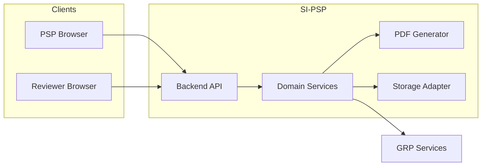

# Product Requirements Document (PRD) — SI-PSP

| Field | Value |
| --- | --- |
| **Product** | SI-PSP — Sistema de Control de Informes para Prestadores de Servicios Profesionales |
| **Repository** | `supplier` |
| **Source specification** | [`docs/RequirementsSpecification.md`](../docs/RequirementsSpecification.md) |
| **SDD standards** | `ai-specs-master/ai-specs/specs/prd-requirements-standards.md`, `flujo-desarrollo-standards.md` |
| **Discovery Gate (Fase 0)** | **Closed** — [`discovery-gate.md`](discovery-gate.md) (2026-05-10) |
| **Product decisions** | **2026-05-10** — [`open-questions.md`](open-questions.md) (all #1–#10 Closed); letters **1A 2B 3A 4A 5A 6A 7A 8A 9A 10C** per [`decision-options.md`](decision-options.md) |
| **Gate-PRD (Fase 2)** | **Passed** — [`gate-prd.md`](gate-prd.md) (2026-05-10) |
| **Análisis crítico** | [`PRD-analisis-critico.md`](PRD-analisis-critico.md) (2026-05-10) |
| **ADRs** | [`adrs/README.md`](adrs/README.md) — ADR-001 … ADR-003 (2026-05-10) |
| **Status** | Draft — proceed to UX flows / Redmine tickets; GRP **real** contract still external dependency |

---

## 1. Executive Summary

### 1.1 Problem Statement

Professional service providers (PSPs) must submit structured monthly activity reports aligned with their contracts, with evidence, internal review, and electronic signature before payment can be processed. Today this process is fragmented, error-prone (free-text drift, wrong periods, duplicate months), and depends on manual coordination with **GRP** (contract source of truth and signature/payment rails). Without a dedicated system, reporting quality, auditability, and time-to-pay suffer.

### 1.2 Proposed Solution

**SI-PSP** is a web application that:

1. Authenticates PSPs by **RFC** and validates **active contract** data via GRP.
2. Enforces a **one-time per contract** catalog of activities/clauses before any monthly report can reference them.
3. Generates **monthly report periods and weekly rows** from the contract start date (cutover day-of-month rule) and guides the PSP to report **in sequence** without duplicates or skipped months.
4. Supports structured capture (period, activity from catalog, achievement description, image evidence) and a **standard PDF** (header from GRP, activity table, photo annex, signature sheet).
5. Implements a **strict report state machine** (draft → in review → rejected/approved → signed/finalized) with GRP APIs for **query, signature, and reception / payment readiness**.

### 1.3 Success Criteria (3–5 measurable KPIs)

| ID | KPI | Target | Baseline / notes |
| --- | --- | --- | --- |
| **KPI-1** | **Period correctness** — share of monthly reports whose generated weekly periods match the contract cutover rules (audit sample) | ≥ **99%** in UAT; **100%** for known golden fixtures | Golden fixtures owned by **Tech lead**; UAT sample size **≥ 20** reports or full regression suite per release (whichever is larger). |
| **KPI-2** | **No free-text activity keys** — % of report lines linked to a catalog activity ID | **100%** | Baseline: N/A (greenfield). |
| **KPI-3** | **Review cycle time** — median time from PSP “Submit” to “Approved” or “Rejected” | **Target set after month 1 post go-live** (decision #1-A); initial goal: **≤ 5 business days** median once baseline measured | Baseline = median of first **full calendar month** in production (**owners: PM + Tech lead**). |
| **KPI-4** | **End-to-end signature completion** — % of approved reports that reach **`SIGNED_FINALIZED`** without manual intervention beyond GRP SLA | **Target set after first 30 rolling days** post go-live; initial goal: **≥ 95%** | Baseline from go-live window; polling/retry per **#9-A**; final semantics when **real** GRP contract is wired. |
| **KPI-5** | **Duplicate / out-of-sequence prevention** — incidents of duplicate month or skipped month detected in production | **0** *critical* incidents per quarter | **Critical** = user-visible duplicate **submitted** report for the same `(contract, month)` **or** a month skip that reaches **IN_REVIEW** or beyond without explicit exception workflow. Monitored via app logs + support register (**owner: Tech lead**). |

---

## 2. User Experience & Functionality

### 2.1 User Personas

| Persona | Description | Primary goals |
| --- | --- | --- |
| **PSP (Proveedor)** | Professional service provider identified by **RFC** | Register activities once per contract; complete monthly reports with evidence; submit for review; fix rejections; complete signing flow. |
| **Reviewer** | Technical area or **Responsable de Proyecto** | Review submitted reports; approve or reject with **mandatory comments** on rejection. |
| **GRP (system)** | External system of record for contract, validity, signature, payment notification | Serve contract/consultation by RFC; sign PDF; acknowledge finalized report for payment processing. |

**Reviewer assignment (decision #7-A):** each **contract** or **project** has a **configured list of reviewer user accounts** in SI-PSP; only those users may approve or reject reports for that scope.

*Note: administrative roles (user support, GRP ops) remain **TBD** if needed beyond these personas.*

### 2.1.1 MonthlyReport — state machine (normative)

Persisted states for the monthly report aggregate (align with source lifecycle; English enum names for implementation):

| State | Meaning |
| --- | --- |
| **DRAFT** | PSP may edit; not yet submitted, or **returned after rejection** (PSP edits again). |
| **IN_REVIEW** | Submitted; PSP **cannot** edit; reviewers may approve or reject. |
| **APPROVED** | Review accepted; PSP **cannot** edit content; signing / PDF finalization enabled per **US-08**. |
| **SIGNED_FINALIZED** | Signed PDF stored; reception to GRP executed per policy; terminal (**immutable**). |

**Allowed transitions** (any other attempt → `409` / domain error, no partial persistence):

| From | Guard / event | To | Actor |
| --- | --- | --- | --- |
| **DRAFT** | Submit succeeds (completeness **AC-06-2**) | **IN_REVIEW** | PSP |
| **IN_REVIEW** | Approve | **APPROVED** | Reviewer (allow-listed) |
| **IN_REVIEW** | Reject with required comments | **DRAFT** | Reviewer (allow-listed) |
| **APPROVED** | Sign flow completes successfully | **SIGNED_FINALIZED** | System (GRP + polling **US-08**) |

**Out of scope (MVP):** withdraw from **IN_REVIEW** back to **DRAFT** by PSP; reopen **APPROVED** to **IN_REVIEW**; parallel approvers — unless added by change request (**explicit non-goals** unless extended).

**Contract expired (US-02):** is a **global access guard**, not a row in the table above: write APIs return `403`; reads allowed for history.

### 2.2 User Stories and Acceptance Criteria

*Format: stories and AC in **English** per SDD. IDs are stable for traceability to UX flows, tickets, and tests.*

---

#### US-01 — RFC login and first-time password

**Story:** As a **PSP**, I want to **sign in using my RFC and, on first successful contract validation, set my password** so that **only I can access my reports under that contract identity**.

**Acceptance Criteria**

- **AC-01-1 (happy path):** Given a valid RFC with an **active** contract in GRP and no prior SI-PSP credentials, when the PSP completes identity/contract verification, then the system prompts for password creation and stores credentials securely, and the PSP gains access to the application.
- **AC-01-2 (validation):** Given an RFC with **no** active contract in GRP, when the PSP attempts access, then the system **denies** full access consistent with **US-02** (read-only or blocked for new reports per rules).
- **AC-01-3 (error):** Given GRP consultation is **unavailable** or returns an **unparseable** response, when the PSP attempts login, then the system returns a **safe, non-sensitive** error, logs the failure, and does **not** create or partially create an account. **Retry:** client may retry login **up to 3** attempts with exponential backoff (base **2s**, cap **30s**); server-side rate limits apply.

---

#### US-02 — Expired contract: read-only

**Story:** As a **PSP**, I want **read-only access when my contract is expired** so that **I can consult history but cannot create new reports**.

**Acceptance Criteria**

- **AC-02-1:** Given GRP indicates the contract is **not active / expired**, when the PSP accesses SI-PSP, then **creating new monthly reports** and **mutating** existing reports are **disabled** (UI + `403` on write APIs); the UI explains the reason at a high level (**decision #10-C**).
- **AC-02-2:** Given an expired-contract PSP, when they navigate the app (**decision #10-C**), then the **same screens** apply as for an active contract but **all mutation actions are disabled**; the PSP sees **full report history** (all states). **Retention** of reports and evidence: **contract lifetime + 1 year** (**decision #8-A**), then archival/deletion per org policy.

---

#### US-03 — One-time activity catalog per contract

**Story:** As a **PSP**, I want to **register my contract’s activities (ID + description) once** so that **all monthly lines reference the catalog instead of free-text activity names**.

**Acceptance Criteria**

- **AC-03-1:** Given an active-contract PSP who has **not** completed the catalog, when they try to start a monthly report, then the system **blocks** report creation and directs them to complete activities first.
- **AC-03-2:** Given the catalog is completed, when the PSP adds a monthly report line, then **Activity** is chosen **only** from the catalog (dropdown), not free entry.
- **AC-03-3 (error):** Given duplicate activity IDs or empty description, when the PSP saves the catalog, then the system rejects with **field-level** validation messages.
- **AC-03-4 (idempotency):** Given the catalog was already completed for the contract, when the PSP retries “complete catalog”, then the system **does not** create duplicate master rows (single source per contract). **After completion the catalog is immutable** (**decision #5-A**): no edit/delete of activities through the PSP UI; write APIs return `403`/`409` if attempted.

---

#### US-04 — Monthly periods, weekly rows, and sequencing

**Story:** As a **PSP**, I want the system to **compute monthly cutover and weekly rows from my contract start date** and **suggest the next month/period in order** so that **I avoid duplicates, skips, and wrong week buckets**.

**Acceptance Criteria**

- **AC-04-1 (cutover):** Given contract start date **D** (day-of-month), when the system builds a monthly report for a calendar month **M**, then the **cutover day** is **D** if that date exists in **M**; if **D** does **not** exist in **M** (e.g. D=31 and February), the cutover is the **last calendar day** of **M** (**decision #3-A**). All calendar interpretations use zone **`America/Mexico_City`** for civil dates (**decision #4-A**); instants persisted in **UTC**.
- **AC-04-2 (week buckets):** Given a reporting month, when the system builds Section 2 rows, then it generates rows for **Week 1** (day after contract start in scope through following Sunday), **intermediate** full Mon–Sun weeks, and **closing week** (last Monday through cutover), per the source specification.
- **AC-04-3 (suggestion):** Given prior submitted/finalized history, when the PSP opens “new report”, then the system **suggests** the next eligible month/period and **blocks** a second **DRAFT** for the same `(contract, month)` (**decision #6-A**): at most **one** active draft per month; opening “new” for that month **resumes** the existing draft unless the user explicitly **discards** draft via confirmed action (discard deletes draft content per product confirmation copy).
- **AC-04-4 (error):** Given the user attempts to report a month **out of sequence**, when they submit, then the system **rejects** with a clear rule message. **MVP:** no stakeholder exception workflow; exceptions are **out of scope** unless added by change request.

---

#### US-05 — Structured capture and photographic annex

**Story:** As a **PSP**, I want to **fill a structured table per weekly period** (activity, achievement, evidence images) so that **my PDF includes a consistent activity section and photo annex**.

**Acceptance Criteria**

- **AC-05-1:** Given a generated period row, when the PSP views the row, then **Period** is **read-only** auto-generated; **Activity** is catalog-driven; **Description** is editable text.
- **AC-05-2:** Given the PSP attaches evidence images, when images are stored, then each image is **associated to the activity ID** for that row and included in the **photo annex** in **stable upload order** (insertion order within the row).
- **AC-05-3:** Given images attached to a row, when the PDF is generated, then images are **resized** to fit layout. **MVP limits (#8-A):** formats **JPEG, PNG, WebP** only; **≤ 5 MB** per file; **≤ 5** images per period row.
- **AC-05-4 (error):** Given unsupported file type or oversize file or more than five files per row, when upload is attempted, then the system rejects with a **specific** validation error.

---

#### US-06 — Report lifecycle (draft → review → reject/approve)

**Story:** As a **PSP** and **Reviewer**, I want a **strict lifecycle** so that **only valid, complete reports move to approval and signing**.

**Acceptance Criteria**

- **AC-06-1 (draft edit):** Given state **DRAFT**, when the PSP edits and saves, then changes persist and the PSP retains edit rights.
- **AC-06-2 (submit guard):** Given state **DRAFT**, when the PSP clicks **Send/Submit**, then the system verifies **all** period rows for the month have **non-empty description**; **evidence** per row is **optional** in MVP unless a row explicitly marks “evidence required” (**future**). If validation fails, submit is **blocked** with a summary.
- **AC-06-3 (in review):** Given successful submit, when the report transitions to **IN_REVIEW**, then the **PSP loses edit** rights until the report returns to **DRAFT** (**§2.1.1**).
- **AC-06-4 (reject):** Given **IN_REVIEW**, when the reviewer rejects, then the system **requires comments**, transitions to **DRAFT** (per **§2.1.1**; no separate persisted **REJECTED** state), and appends an **audit record** (`timestamp`, `reviewerId`, `comments`, `previousState` = `IN_REVIEW`).
- **AC-06-5 (approve):** Given **IN_REVIEW**, when the reviewer approves, then the report becomes **APPROVED**, **immutable** for PSP edits, and **enables** the signing/export path (**US-08**).
- **AC-06-6 (state violations):** Given any transition not allowed by the state machine, when an API or UI action is attempted, then the system **rejects** with `409`/domain error and **no partial state change**. **Duplicate submit:** a second submit while already **IN_REVIEW** returns **409** with body indicating current state (no duplicate submission created).

---

#### US-07 — Standard PDF output

**Story:** As a **PSP**, I want a **standard PDF** with **header (from GRP), activity description, photo annex, and signature sheet** so that **downstream signature and archiving are consistent**.

**Acceptance Criteria**

- **AC-07-1:** Given an **APPROVED** or signing-eligible report, when PDF is generated, then it contains the **four** mandatory sections from the source specification (Header, Activity description table, Photo annex, Signature sheet).
- **AC-07-2:** Given GRP header fields (provider, contract, project, unit, location), when the PDF is built, then header data is **fetched via the GRP adapter** (live call or **snapshot taken at PDF generation time** stored on the report entity); missing mandatory fields **block** generation with a **clear** error.
- **AC-07-3:** Given the photo annex, when rendered, then each image is **labeled** with its **activity ID** reference as specified.

---

#### US-08 — Electronic signature and finalized handoff to GRP

**Story:** As the **system**, I want to **send the PDF to GRP for signature, receive the signed document, and notify GRP that the report is ready for payment** so that **the PSP can complete the official cycle**.

**Acceptance Criteria**

- **AC-08-1:** Given **APPROVED** report, when the PSP triggers signing, then SI-PSP calls GRP **Sign** service with the generated PDF. If GRP returns **async** correlation ID, the backend **polls** (**decision #9-A**) with exponential backoff (e.g. initial interval **30s**, max **5m**, jitter) until **signed** artifact available or **timeout** (default **24h** unless ADR overrides). Stub implementation follows the same interface for UAT.
- **AC-08-2:** Given a signed PDF is received, when persistence completes, then the report state becomes **`SIGNED_FINALIZED`** (**§2.1.1**) and the artifact is **immutable**.
- **AC-08-3:** Given finalized report, when reception is invoked, then GRP **Reception** is notified; on transient failure, **retry** with backoff (same family as polling, capped attempts **TBD** in ADR). User-visible status shows **pending / failed / delivered** per UX copy.
- **AC-08-4 (idempotency):** Given duplicate finalize or duplicate reception calls, when retries occur, then the client uses a **single `receptionAttemptId`** (UUID generated once per finalized report) sent on each retry; until GRP confirms idempotency keys, operations log **at-most-once** delivery and **manual reconciliation** is documented in the integration ADR.

---

### 2.3 Non-Goals

| ID | Non-Goal | Rationale |
| --- | --- | --- |
| **NG-01** | **Replacing GRP** as contract system of record | SI-PSP consumes GRP; scope is reporting and signature orchestration. |
| **NG-02** | **Full ERP / payment execution** inside SI-PSP | Payment processing stays in GRP; SI-PSP ends at finalized handoff unless PRD is extended. |
| **NG-03** | **Arbitrary free-text activity naming** in monthly lines | Defeats catalog purpose; out of scope. |
| **NG-04** | **Multi-tenant supplier management** beyond RFC-scoped PSP experience | Unless stakeholders expand scope; **TBD**. |
| **NG-05** | **Offline-first mobile capture** | Not in source specification; potential future phase. |

---

## 3. Technical Specifications

### 3.1 Architecture Overview

SI-PSP is a **web application** with a **backend** (this repo: Spring Boot) and a **frontend** (**TBD** stack). Core boundaries:

- **Presentation:** PSP and Reviewer UI; authentication flows.
- **Application:** Report orchestration, state machine, period engine, PDF generation, evidence handling.
- **Domain:** Activity catalog, Monthly report aggregate, Period rows, Evidence attachments.
- **Infrastructure integration:** GRP Query, Sign, Reception APIs; object storage for images/PDFs (**TBD**).

*Detailed deployment (VPC, secrets, observability): **TBD** — see `deploy-standards` when adopted.*

### 3.2 Data Structures (reference)

| Entity / concept | Key fields (illustrative) | Notes |
| --- | --- | --- |
| **Contract context** | `rfc`, `contractId` (GRP), `startDate`, `status` (active/expired) | Query via GRP adapter; optional short-lived cache **TBD** in ADR (TTL, invalidation). **DTO esperado GRP:** [`integrations/Contrato-GRP-esquema.md`](integrations/Contrato-GRP-esquema.md). |
| **Activity** | `activityId`, `description`, `contractId` | Unique per contract. |
| **MonthlyReport** | `reportId`, `contractId`, `month` (or period key), `state`, audit timestamps | State enum aligns with §4 source doc. |
| **PeriodRow** | `weekType`, `periodLabel`, `activityId`, `description`, `evidenceRefs[]` | `Period` non-editable in UI. |
| **Evidence** | `fileId`, `mimeType`, `activityId`, `reportId`, `rowId` | Enforce **#8-A** limits at upload; storage backend **TBD** (object store vs DB). |

*Canonical physical schema: **TBD** in `data-model` / ADRs.*

### 3.3 Integration Points (GRP)

**MVP strategy (#2-B):** SI-PSP implements a **GRP adapter** against a **frozen internal OpenAPI** (contract + stub/mock). UAT and CI use the stub; production swaps to real endpoints when GRP delivers the **authoritative** spec — deltas tracked in an **ADR**.

| Integration | Direction | Purpose | Contract validation |
| --- | --- | --- | --- |
| **Query service** | SI-PSP → GRP | Contract and validity by **RFC**; header fields for PDF | Internal OpenAPI + stub; replace with GRP schema when available. **Payload de referencia:** [`integrations/Contrato-GRP-esquema.md`](integrations/Contrato-GRP-esquema.md). |
| **Sign service** | SI-PSP → GRP → SI-PSP | Submit PDF; receive signed PDF (sync or async + **polling** per #9-A) | Same |
| **Reception service** | SI-PSP → GRP | Notify report finalized / payment-ready | Same |

*Auth (mTLS, OAuth2, API keys), production URLs, SLA, and canonical error codes come from **GRP** when delivered; stub uses documented surrogate errors for tests.*

### 3.4 Security & Privacy

- **Authentication:** Password-based local account bound to RFC after GRP validation (**policy:** complexity, rotation, lockout — **TBD**).
- **Authorization:** PSP may access only their own contract/report data. **Reviewers** are users on the **per-contract or per-project allow list** configured in SI-PSP (**#7-A**); they may approve/reject only reports in scope. **Admin** configuration of allow lists is **TBD** (role `ADMIN` vs external config).
- **Data protection:** Evidence images and PDFs may contain sensitive project data; encryption at rest/in transit (**TBD** per org standards).
- **Logging:** No RFC/password/evidence content in logs; correlation IDs for GRP calls.

### 3.5 Error Handling, Idempotency, and Reliability

| Concern | Required behavior | Detail |
| --- | --- | --- |
| **GRP transient failures** | User-visible degradation + retry | Exponential backoff on outbound calls (initial **1s**, max **30s**, max **5** retries per user-facing operation unless ADR overrides); circuit breaker after sustained failures (**threshold TBD** in ADR). |
| **Submit / approve / sign** | No ambiguous partial states | DB transactions per state transition; **outbox** for async GRP side-effects (**ADR**). |
| **Duplicate operations** | Safe retries where possible | **Reception:** `receptionAttemptId` UUID; **Sign polling:** idempotent reads by `signJobId`. |
| **Partial uploads** | Clean failure | Aborted multipart sessions **expired after 24h**; orphan blobs eligible for GC (**ADR**). |

### 3.6 Specialized System Requirements

- **Period engine:** Deterministic generation of weekly buckets from `contract.startDate` and month **M**; **cutover** uses **last day of M** when day **D** absent in **M**; civil dates in **`America/Mexico_City`**, persistence in **UTC**. Golden tests required (**KPI-1**).
- **PDF generation:** Template layout for four sections; image downscaling to respect **5 MB / five files per row**; PDF/UA accessibility **TBD** (non-blocking for MVP unless mandated).

---

## 4. Risks & Roadmap

### 4.1 Phased Rollout (proposal)

| Phase | Scope | Exit criteria |
| --- | --- | --- |
| **P0 — Foundation** | Auth + GRP query + activity catalog + one report draft | UAT with golden period fixtures |
| **P1 — Lifecycle** | Submit/review/approve/reject + completeness validation | Reviewer workflow in UAT |
| **P2 — Document** | PDF + annex + GRP sign + reception | End-to-end demo with GRP sandbox |
| **P3 — Hardening** | Observability, security review, performance, admin tooling **as needed** | Production readiness checklist |

*Exact timeline: **TBD** (stakeholder).*

### 4.2 Technical Risks

| Risk | Impact | Mitigation |
| --- | --- | --- |
| **GRP API delays or contract churn** | Blocks E2E | Mock servers + ADR per integration; feature flags |
| **Calendar edge cases** (short months, timezone) | Wrong periods | **Resolved:** last-day-of-month rule + `America/Mexico_City` + UTC storage; golden tests |
| **Large evidence uploads** | Cost, timeouts | Enforced **5 MB × 5 files** per row; client-side validation + server rejection (**#8-A**) |
| **Exactly-once with Reception** | Double payment signals | Coordinate idempotency with GRP |

### 4.3 Open Questions (stakeholders)

**Product decisions #1–#10** are **Closed** as of **2026-05-10** — see [`document/open-questions.md`](open-questions.md) and [`document/decision-options.md`](decision-options.md) (letters **1A 2B 3A 4A 5A 6A 7A 8A 9A 10C**).

**Remaining external dependency:** authoritative **GRP** OpenAPI, credentials, production URLs, and **confirmed** idempotency semantics from the GRP vendor — tracked via **ADR** when received (stub remains until then).

---

## 5. Traceability

| This PRD | Source (`docs/RequirementsSpecification.md`) |
| --- | --- |
| US-01, US-02 | §1 Arquitectura de Acceso y Usuarios |
| US-03 | §2 Configuración de Proyecto |
| US-04, US-05 | §3 Gestión de Reportes Mensuales |
| US-06 | §4 Ciclo de Vida del Reporte |
| US-07 | §5 Estructura del Output (PDF) |
| US-08 | §6 Integración Técnica (APIs) |

---

*End of PRD draft.*
